# AllDone (Todo List Application)
This is a to-do list application for ADA SQA (Software Quality Assurance) Week 2 assignment

## Project Description

This project is a simple to-do list application designed to help users manage their tasks efficiently. The app provides a user-friendly interface that allows users to create, edit, and delete tasks, ensuring they can stay organized and productive. The concept is broad and can aid users in achieving any goal including fitness, financial and social, limited only by their imagination. It includes user authentication to secure user data and ensures only authorized access to personal task lists. The UI is simple, intuitive and scalable as more tasks are added.

### Key Features
1. User Authentication
    * Secure login process with JWT-based authentication.
2. Task Management
    * Create Tasks
    * Delete Tasks
    * Edit Tasks
    * Mark tasks as completed to keep track of progress.

### Screenshots

### Login Page
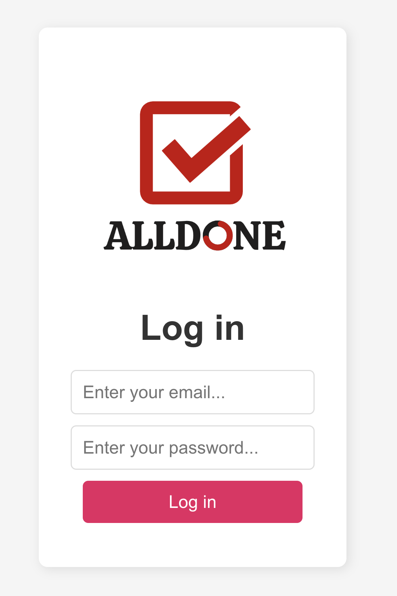

### Invalid Email:
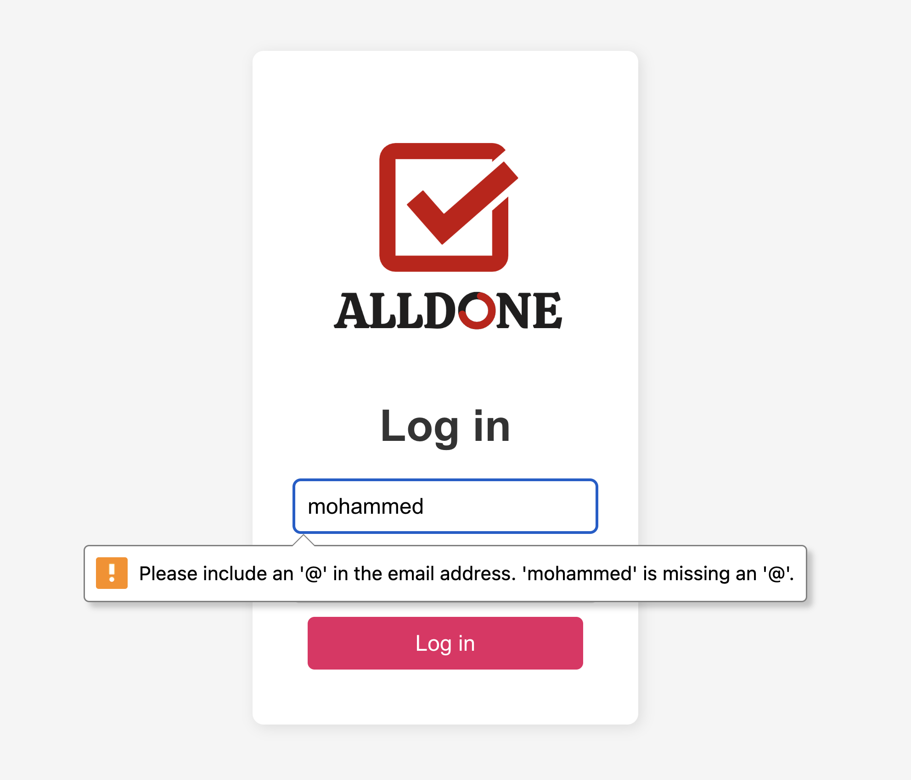

### Empty Task List:
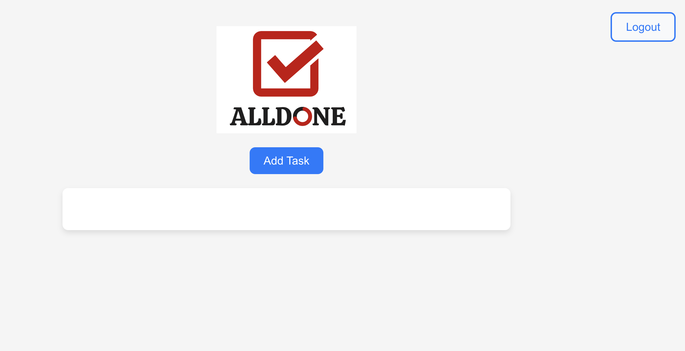

### Add Task Modal:
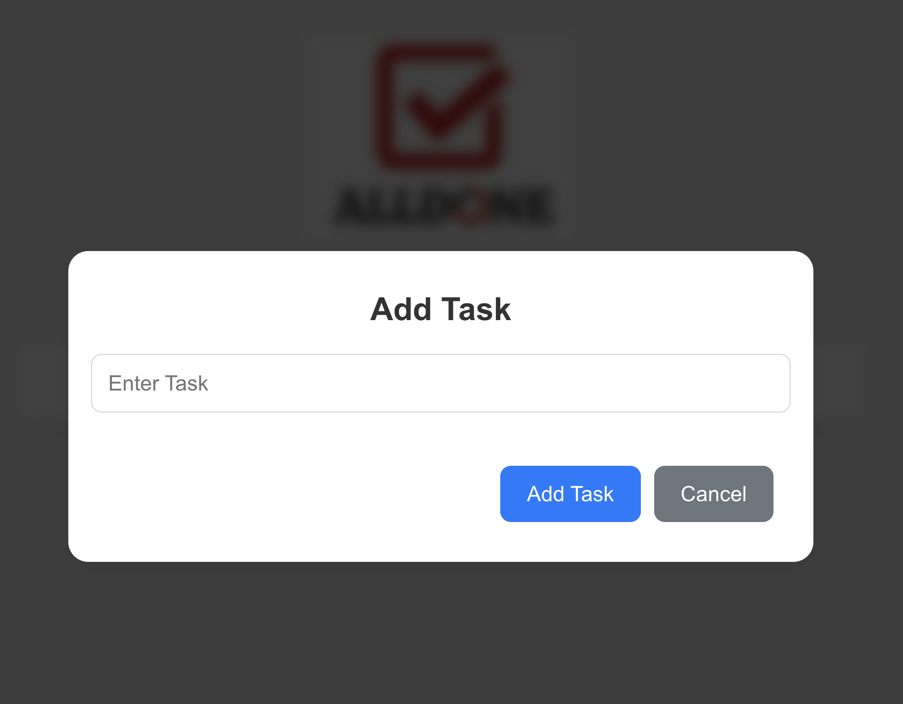

### List with Checked Task
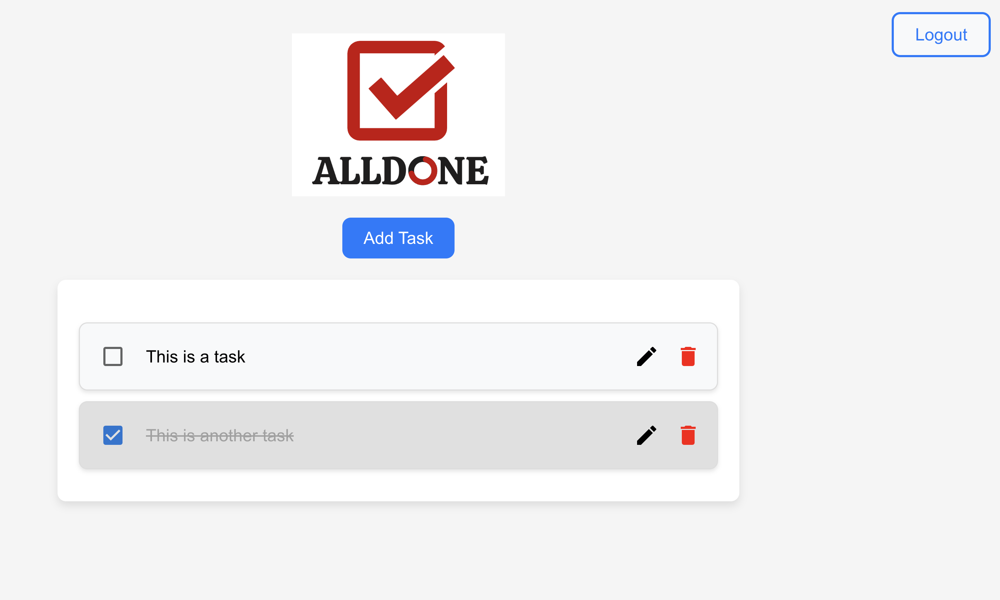

### Empty Task Error Messaging
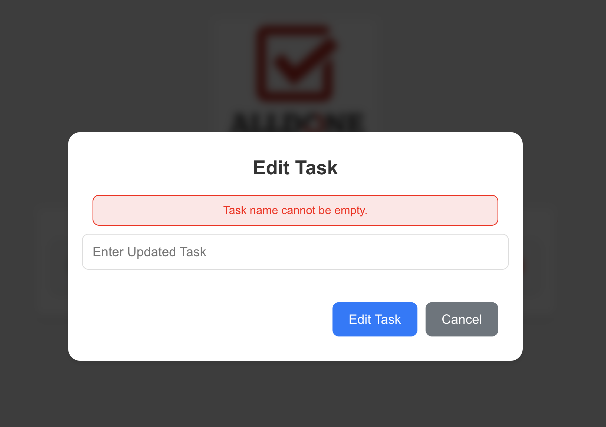

## Team Description
This was a solo project. As a result, I took the opportunity to embody multiple roles within the SDLC. 

Key Roles and Responsibilities:

## Tools Used

### Version Control
* Git, GitHub, GitHub Actions

Git is the industry standard for version control within modern software development projects like mine. GitHub was selected as a host for the repository as it facilitated seamless pull requests and code review. It also contains an inbuilt CICD mechanism: GitHub Actions. This allowed me to accomplish all my development objectives within one platform.

### Testing
**Backend Testing:**
* Pytest

This testing framework was ideal for our Flask-based backend because it supports fixtures for setting up and tearing down test environments easily, and its simple syntax allows for efficient test writing and maintenance.

**Frontend Testing:**
* Jest
* React Testing Library

Jest is a JavaScript testing framework that works well with React, providing a comprehensive solution for unit and integration testing. On the other hand, React Testing Library focuses on testing React components from a user's perspective, ensuring that the app behaves as expected in real-world scenarios.

### Backend
* Programming language: Python
* Framework: Flask
* Libraries used: Flask JWT Extended, Flask CORS

Python's simplicity and readability made it an excellent choice for developing the backend, enabling rapid development and easy maintenance. Flask's lightweight and modular nature allowed for building a scalable and flexible backend. It’s perfect for small to medium-sized applications like our To-Do list app.

Flask JWT Extended provided robust and secure JWT-based authentication, which is essential for managing user sessions in a modern web app. Flask CORS simplified the handling of Cross-Origin Resource Sharing, allowing the frontend and backend to communicate seamlessly despite being on different origins.

### Frontend
* Programming Language: Javascript
* Framework: React
* Libraries used: Axios (for HTTP requests), React Router DOM, React Modal

Javascript and React and ubiquitous in web development and make for a responsive, dynamic, and highly modular frontend. I also, used Axios for HTTP requests to the backend.

### Linting
* ESLint
* Stylelint

ESLint and Stylelint were used to ensure code quality, consistency in logic and styling. This kept us adherent to a set standard.

### Other tools

I used **Trello** for project management, as it works well for Kanban. It's boards, lists and cards were useful when tracking progress within my workflow. Moreover, I ran a comprehensive accessibility audit using  **Google Lighthouse**. It provided me with accessibility, performance, SEO, and best practices, helping to identify and fix issues.

## Instructions to Run and Use the Application

### Prerequisites

Before running the application, ensure you have the following software installed on your machine:
* Python (version 3.11 or higher)
* Node.js and npm (Node.js version 14.x or higher, npm version 6.x or higher)
* Poetry (for Python dependency management)

### How to Clone the Repository

Clone the repository to your local machine by running this command:

```git clone https://github.com/mdh411/all-done-app.git```

### How to Setup and Run Backend and Frontend
* Navigate to the backend directory using ```cd backend```
* start the backend Flask server by running ```poetry run flask run```

To setup the frontend:
* Navigate to the frontend directory using ```cd ../frontend```
* Run ```npm i``` to install dependencies
* Start React server using ```npm start```

### How to Lint
* Lint python code using ```poetry run flake8```
* Lint frontend code using ```npm run lint```
* Stylelint using ```npm run lint:styles```

### How to Run Tests
* Test backend using ```poetry run coverage run -m pytest```
* Test frontend using ```npm test```

### App Features
The app has several features, whereby users can:
* Securely login to their personal tasklist
* Click on 'Add Task', which will open a modal for them to add and submit a new task
* Click on the 'Edit' icon for a task to open a modal for them to edit their selected task
* Click on the 'Delete' icon to remove a task from their list
* Click the 'Checkbox' to mark a task as done. This will reflect in the row being greyed out and the text having a ~~strikethrough~~

## Project Workflow
For this project, a combination of agile methodologies and project management tools were used to ensure an efficient and organized workflow.

### Kanban Board
Trello was used to manage tickets and track progress. Tasks were organized into different columns such as "To Do", "In Progress", "Code Review", "Testing' and "Done". Each task was represented as a card that could be moved across columns as the task progressed. I outlined the tickets with their Acceptance Criteria to guide my development, which gave me a clear 'definition of done'. This gave me a clear visual representation of where the project stood.

#### Trello Board


#### Example Ticket
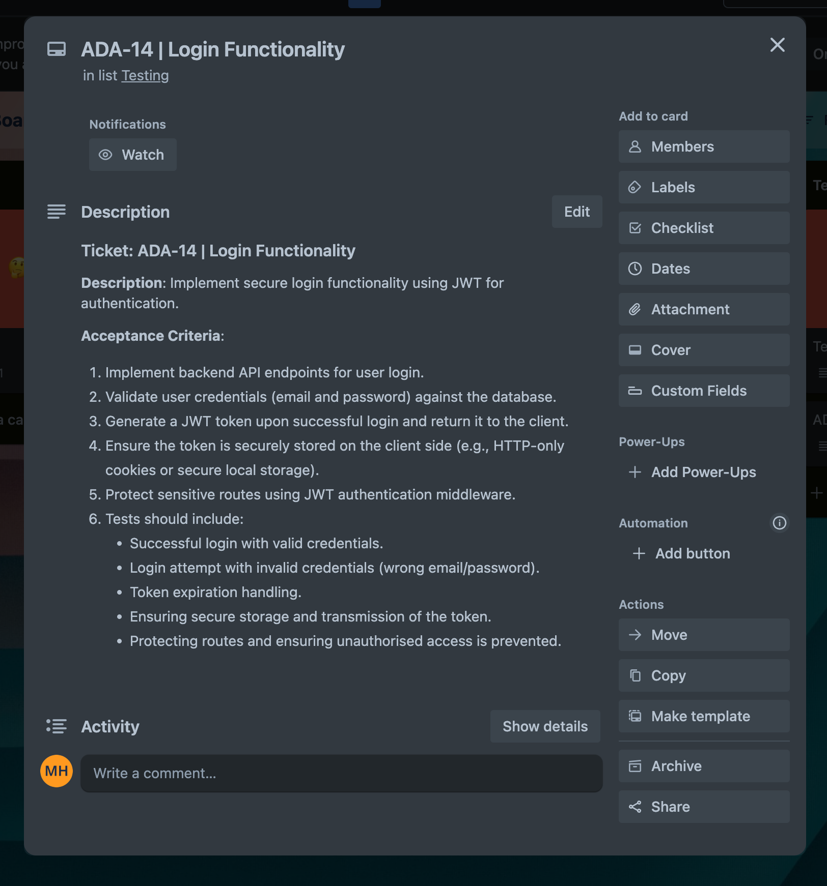

### Agile Ceremonies
I adopted a somewhat unconventional agile approach as I was working independently but I took benefit from the flexibility of agile to incrementally build my application within a one-week sprint. It kept me open to changing priorities as I progressed with development.

Prior to implementation, I researched the tools and libraries best suited for my project needs. Next, I did a sprint plan using my Kanban board to prioritise tickets. I conducted daily self-reviews to evaluate positives and areas of improvement in my approach and implementation. These kept me focused, accountable, and acted as both standups and retrospectives. I documented any insights (using Google Docs) to mould future work.

## Test Methodologies and Tools
I applied a range of testing methodologies and tooling throughout the development phase. These were incorporated in an agile manner as I maintained continuous testing to allow early bug and error detection. In the planning phase, I drafted a plan detailing the test cases I would write based on the ticket requirements.

### Types of Testing

#### Unit Testing
Unit tests were primarily focused on individual components and functions to ensure they work as expected in isolation; it is assumed that they have not impacted anything else. They are the highest in number because each function and pathway needed testing. I wrote them using the pytest framework for the backend and React Testing Library with Jest for the frontend. Unit tests cover both the logic of the application and the user interface elements. Jest has a ```test.each``` method which allowed me to test functionality given a range of inputs (valid and invalid) using paramaterised testing. Moreover, I leveraged Jest's built-in support for mocking to mock api calls using ```jest.mock('axios')``` to isolate and test components without making actual network requests. It also supports parallel testing, which sped up the testing process. This will prove more noticeably beneficial as the test suites grow.

I maintained a standard that a pull request cannot be merged unless adequately unit tested. I was aiming for a minimum coverage threshold of 80% and ended up exceeding this with a total coverage of 95% for the backend. My frontend coverage was >92% in all files. I established this threshold to balance between extensive coverage and feasibility as there were other other higher value tasks that needed doing, such as further feature development.

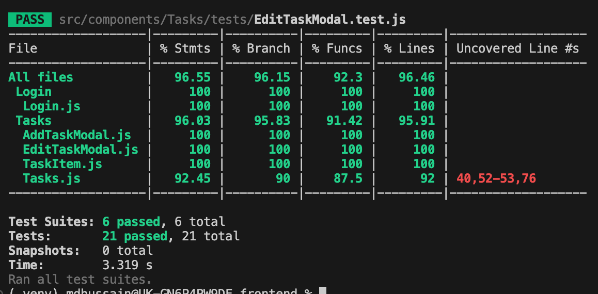

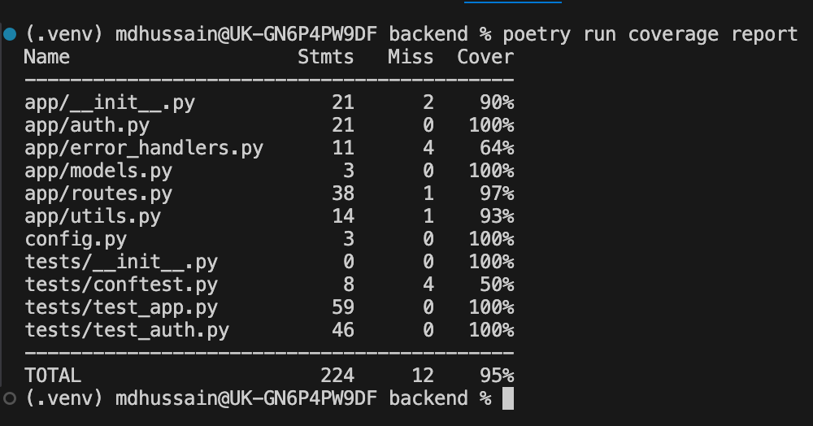

#### Functional Testing
Functional tests were designed to verify that the application behaves as expected from the end user's perspective. These tests simulate real user scenarios and check if the application meets the specified requirements. In my project I performed functional tests to validate the login and authentication features.

#### Integration Testing
Integration testing was crucial in helping me ensure the different modules or components of the application worked together as intended. It helped identify issues that occurred when combining individual units, ensuring that the overall system functions correctly. This type of testing is essential for detecting interface defects, interaction issues, and data flow problems between modules.

I performed some integration tests in the frontend, which checked the interaction between the frontend task management components and the backend API, ensuring tasks are correctly fetched, added, updated, and deleted. Using ```@testing-library/react``` encouraged writing tests that interact with the UI the same way a user would, making tests more meaningful and easier to understand.

For example: Using methods like ```screen.getByText``` and ```fireEvent.click``` to simulate user interactions and verify component behavior.

It also means that components are rendered in a real browser environment, which ensures that integration tests accurately reflect how the components will behave in production.

#### Manual Sanity / Smoke Testing
After coding each pull request, I would take a short break and return to review my code with fresh eyes (to simulate a peer review from a team member). If passed, I would manually sanity test the new feature or fix to ensure there are no blatant bugs. Often the eye can catch bugs that may be difficult to conceptualise just from code.

Before merging, I would manually smoke test the main functionalities of the app to ensure they were still working as intended. The image below depicts the scenarios that were checked against a set of expected outcomes. Although tedious, these are very necessary. Given the size of the application, I decided it was not worth investing time to automate these tests.

**Manual Smoke Tests**

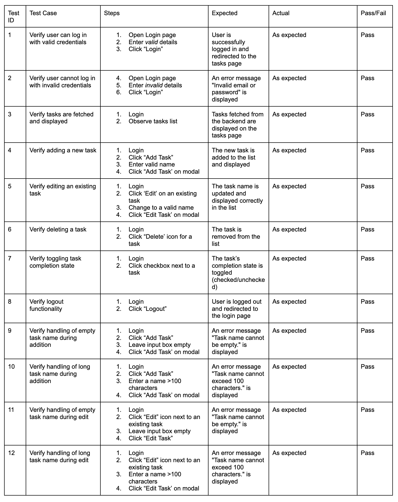

**Backend Test Case Scenarios**

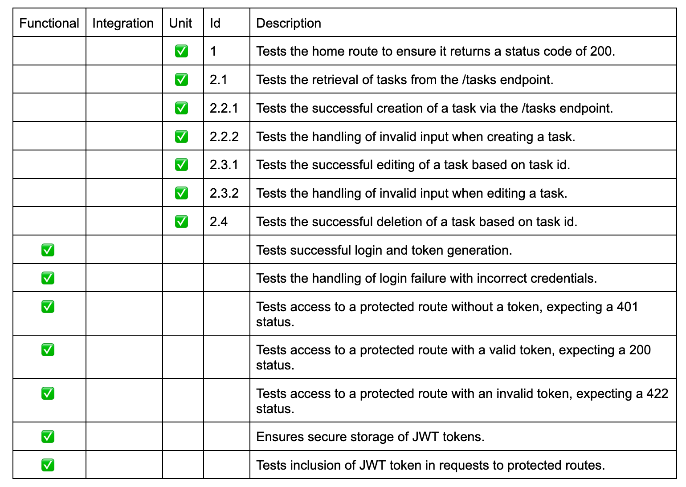

**Frontend Test Case Scenarios**

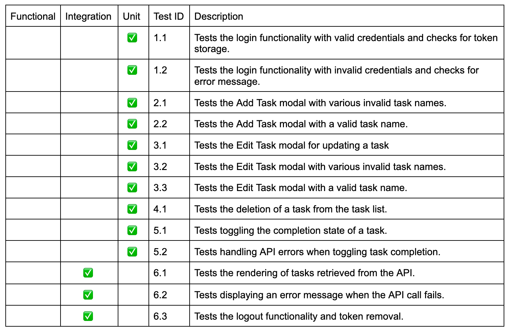